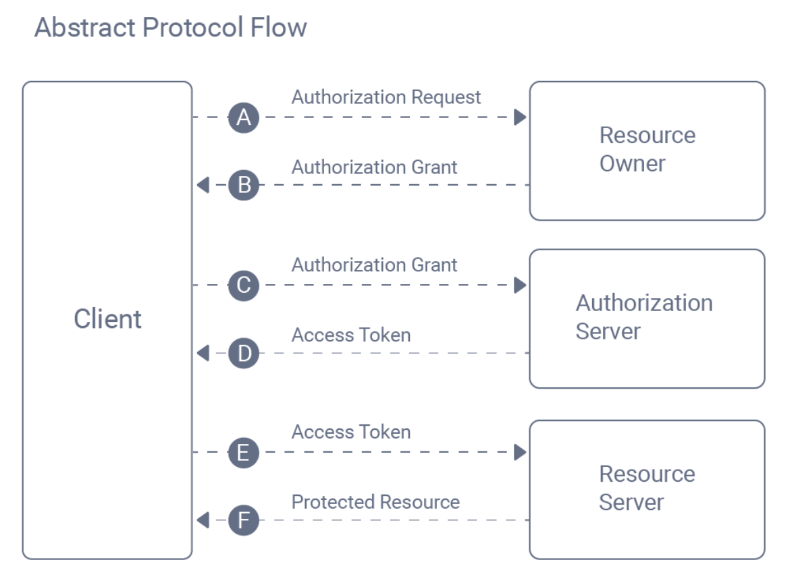

# Google OAuth 2.0 – Express.js

A small learning project focused on implementing the OAuth 2.0 Authorization Code flow using Google and Express.js.

## What I Learned
- OAuth 2.0 Authorization Code flow
- Redirect-based authentication
- CSRF protection using `state`
- Token exchange and ID token usage
- Session-based authentication in Express.js

Also Learned About PKCE and How its Works For Only Frontend Apps.
